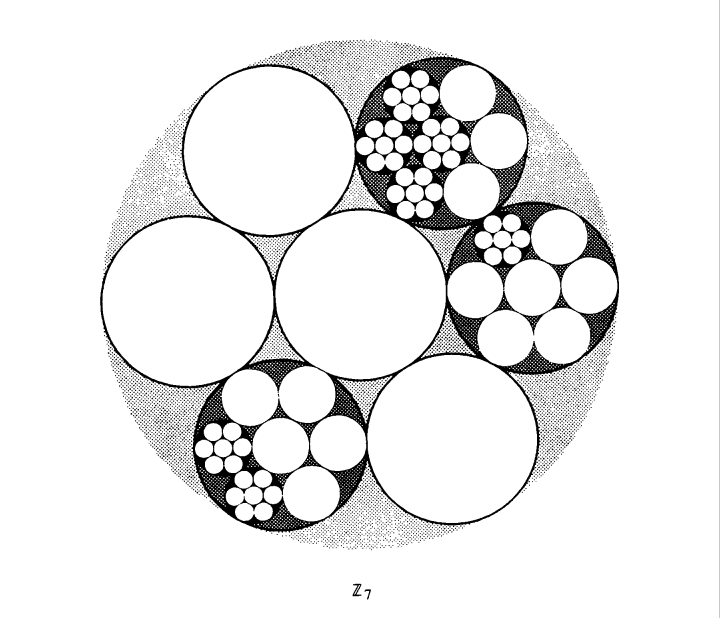

## [Yadi LIU]
I am a postgraduate student of the School of Mathematical Sciences, Capital Normal University.

### Personal information:

**Name:** 刘亚迪 (Yadi LIU)

**Research Interests:** I work on number theory, arithmetic geometry, and automorphic representation.

**Supervisor:** Li Cai

**E-mail:** 2220502124@cun.edu.cn

### [Lecture Notes](https://artinkevin.github.io/notes/)
### [Miscellaneous]
### [Tutoring]
### [Preprints]
### [Publications]
### [Useful Links](https://artinkevin.github.io/Links/)

